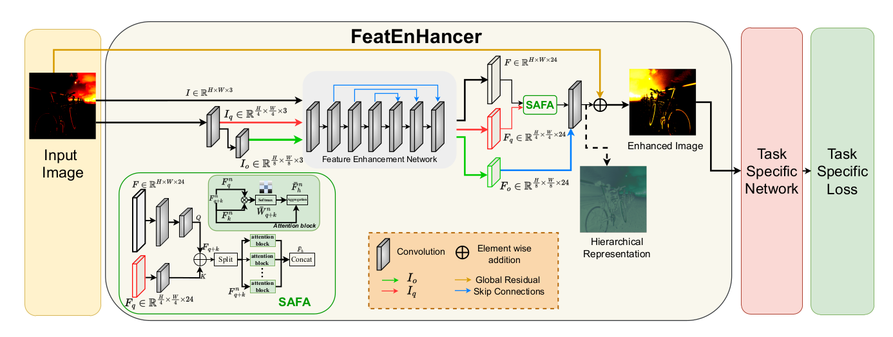

<div align="center">
<h1>FeatEnHancer</h1>

</div>


## Introduction

Extracting useful visual cues for the downstream tasks is especially challenging under low-light vision. Prior works create enhanced representations by either correlating visual quality with machine perception or designing illumination-degrading transformation methods that require pre-training on synthetic datasets. We argue that optimizing enhanced image representation pertaining to the loss of the downstream task can result in more expressive representations. Therefore, in this work, we propose a novel module, FeatEnHancer, that hierarchically combines multiscale features using multi-headed attention guided by task-related loss function to create suitable representations. Furthermore, our intra-scale enhancement improves the quality of features extracted at each scale or level, as well as combines features from different scales in a way that reflects their relative importance for the task at hand. FeatEnHancer is a general-purpose plug-and-play module and can be incorporated into any low-light vision pipeline. We show with extensive experimentation that the enhanced representation produced with FeatEnHancer significantly and consistently improves results in several dark vision tasks, including dark object detection (+5.7 mAP on ExDark), face detection (+1.5 mAP on DARK FACE), nighttime semantic segmentation (+5.1 mIoU on ACDC ), and video object detection (+1.8 mAP on DarkVision), highlighting the effectiveness of enhancing hierarchical features under low-light vision.

<div align="center">



</div>


## Installation and Training

Our methods are based on [detectron2](https://github.com/facebookresearch/detectron2), please refer to [here](https://detectron2.readthedocs.io/en/latest/tutorials/install.html) for more details.

Install the detectron2:

```
git clone https://github.com/facebookresearch/detectron2.git

python setup.py build develop
```

For testing:

Download the FeatEnHancer repo:

```
https://github.com/featanonymiccv2023/FeatEnHancer.git
```

For ExDark testing,

Download the [ExDark](https://github.com/cs-chan/Exclusively-Dark-Image-Dataset) dataset and place the images into data/exdark/ folder and run the test_exdark file
Download the [exdark-checkpoint](https://drive.google.com/file/d/1W1sZZLCv6LroA6WTaitPxOHT1caSwGko/view) file and place it in the checkpoint/ folder.
Run the exdark testing script as below

```
sh test_exdark.sh
```

For DarkFace testing,

Download the [DARK FACE](https://flyywh.github.io/CVPRW2019LowLight/) dataset and place the images into data/darkface/ folder and run the test_exdark file
Download the [darkface-checkpoint]() file and place it in the checkpoint/ folder.
Run the darkface testing script as below

```
sh test_darkface.sh
```


## Results

<div align="center">
  
  <table>
<tr><th> ExDark </th> <th> </th> <th> DARK FACE </th></tr>
<tr><td>

|                          Method                                     |   AP@50   |   AP  |
|:-------------------------------------------------------------------:|:---------:| :-----:  |
|                          Baseline                                   |   74.5    |    47.0  | 
|                            RAUS                                     |   77.0    |   48.1   | 
|                            KIND                                     |   80.5    |   51.5   |  
|                          Zero-DCE++                                 |   79.5    |   49.2   | 
|                           EnGAN                                     |   80.0    |   51.9   |   
|                           MBLLEN                                    |   80.0    |   51.0   |   
|                          Zero-DCE                                   |   80.6    |   52.0   |  
|                            MAET                                     |   81.6    |   52.4   |   
|                       **FeatEnHancer**                              | **86.3**  | **56.5** |  
</td>

<td>         </td>
  
<td>

|                          Method                                     |   AP@50   |   AP  |
|:-------------------------------------------------------------------:|:---------:| :-----:  |
|                          Baseline                                   |   67.5    |   28.6   | 
|                            RAUS                                     |   65.5    |   27.4   | 
|                            KIND                                     |   65.0    |   27.5   |  
|                          Zero-DCE++                                 |   66.2    |   28.2   | 
|                           EnGAN                                     |   67.4    |   28.4   |   
|                           MBLLEN                                    |   67.3    |   27.1   |   
|                          Zero-DCE                                   |   66.9    |   27.5   |  
|                            MAET                                     |   66.1    |   27.1   |   
|                       **FeatEnHancer**                              | **69.0**  | **29.4** | 

</td></tr>
</table>


</div>


